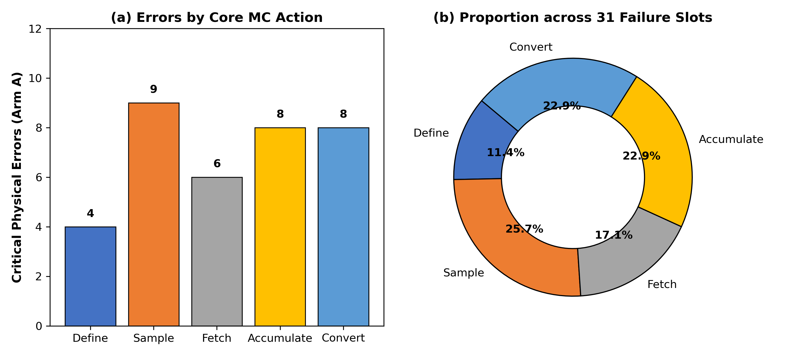

<div align="center">

# ⚛️ NuclearMC-Verifier

### Deterministic Physics Guardrail & Formal Verifier for LLM-Generated Monte Carlo Transport Codes

**大模型粒子输运蒙卡代码（Geant4 / OpenMC）的确定性物理核验器与防幻觉护栏**

<p align="center">
  <a href="LICENSE"></a>
  <a href="https://geant4.web.cern.ch/"></a>
  <a href="https://www.python.org/"></a>
  <a href="benchmark_tasks_reference/"></a>
  
  
</p>

[English](#-english-overview) · [特性亮点](#-特性亮点) · [快速开始](#-快速开始) · [CLI 使用](#-cli-总控工具) · [Agent 插件集成](#-智能体生态集成) · [190 题评测集](#-190-题基准参考库) · [守恒规则](#-物理守恒检验范围)

</div>

---

## 💡 为什么需要 NuclearMC-Verifier？

大语言模型（如 DeepSeek、Claude、GPT-4）编写科学计算代码时，表面语法合规率极高，但在辐射输运（Geant4 / OpenMC）这种高维度随机物理仿真中，频繁产生**静默物理错误（Silent Physical Failures）**：

> **代码 0 警告编译通过，蒙卡模拟也能正常运行退出，但计算出来的吸收剂量、粒子通量或核素活度却出现 $10^2 \sim 10^7$ 倍的隐蔽物理失真！**

```cpp
// ❌ 大模型极易生成的典型代码（编译 100% 成功，物理计算全错）：
G4double dose = totalEdep / volume; 
// 致命缺陷：吸收剂量单位为 Gy (J/kg)，模型漏除了介质密度 (质量 = 体积 × 密度)！
```

```bash
# 🛡️ NuclearMC-Verifier 在代码生成后毫秒级就地拦截：
🚨 [CRITICAL] PHYS-0005 ·【吸收剂量计算量纲失真】
  - 缺陷诊断：检测到吸收剂量直接除以探测器几何体积，缺失靶区介质密度 rho！
  - 修正建议：剂量分母必须显式换算为真实靶介质质量：mass = volume * density;
```

**NuclearMC-Verifier** 通过轻量级 AST 静态分析与第一性原理物理守恒断言，在代码提交或执行前直接拦截物理违约，**彻底杜绝模型靠脑补经验常数“伪收敛”**。

---

## ✨ 特性亮点

- ⚡ **毫秒级纯静态分析**：无需在本地构建或运行臃肿的 Geant4 C++ 模拟环境，纯 AST 规则解析，单文件核验仅需 **< 10ms**。
- 🛡️ **66 条正交物理守恒规则**：覆盖能量动量守恒、立体角相空间测度（$d\Omega = \sin\theta d\theta d\phi$）、统计无偏减方差权重补偿、核反应守恒量子数及框架步进生命周期。
- 🔌 **全主流 Agent 开箱即用**：原生适配 **Google Antigravity**、**DeepSeek Harness (DSH)**、**Anthropic Claude Code**、**OpenCode** 以及 **MCP (Model Context Protocol)** 协议。
- 🎯 **五动作 × 31 槽位闭环分类学**：将蒙卡物理数据流解构为「定、抽、取、记、换」五个基础算子，全方位排查边界条件与生命周期污染。
- 🧪 **190 道严选评测基准题集**：内置 6 大物理领域的完整基准测试代码（单考点、多模块耦合、深穿透动力学及 CERN 社区真实案例）。

---

## 🚀 快速开始

### 1. 安装

本项目基于 Python 3.9+ 构建，克隆即可直接运行：

```bash
# 克隆仓库
git clone https://github.com/SHARK20031010/NuclearMC-Verifier.git
cd NuclearMC-Verifier

# 安装基础依赖
pip install -r requirements.txt
```

### 2. 对蒙卡源码执行核验

对任意 Geant4 C++ 源码运行单文件守恒核验：

```bash
# 核验合规代码
./mc-verifier check benchmark_tasks_reference/tier1_single_slot/T1-1/code/code_ArmA.cc

# 核验包含静默物理漏洞的代码（将输出精准诊断与修复建议）
./mc-verifier check benchmark_tasks_reference/wild_corpus/WILD-01/code/case_buggy.cc
```

---

## 🛠️ CLI 总控工具

仓库根目录自带可执行入口 `./mc-verifier`，统一管理核验状态与各 Agent 挂载：

```bash
./mc-verifier status       # 查看当前核验开关及 5 大 Harness 状态
./mc-verifier on           # 开启刚性守恒门禁（检出物理违约时阻断）
./mc-verifier off          # 临时关闭门禁（进入 0ms 直通模式）
./mc-verifier check <文件> # 针对指定 .cc 源码执行静态核验
./mc-verifier install-all  # 一键为本地所有 Agent 平台挂载插件
```

### 配置文件 (`.mc-verifier.yaml`)

您可以在项目根目录通过配置文件灵活调整审查严格度与规则开关：

```yaml
enabled: true               # 全局开关
strict_mode: true           # true: 阻断提交; false: 仅输出 warning
require_specification: true # 是否强制要求对齐前置物理输入契约

invariants:
  energy_conservation: true      # 能量与动量守恒
  conserved_quantum_numbers: true# 反应电荷/轻子/重子数守恒
  phase_space_measure: true      # 相空间与立体角测度
  fair_game_weight: true         # 减方差权重无偏性
  dimensional_linearity: true    # 量纲链与响应标度
  framework_api_contracts: true  # 生命周期与步进 API 语义
```

---

## 🤖 智能体生态集成

NuclearMC-Verifier 原生支持多平台 Agent，自动在 AI 编写代码时形成守恒护栏：

```text
                        ┌─────────────────────────┐
                        │   NuclearMC-Verifier    │
                        └────────────┬────────────┘
         ┌───────────────────┬───────┴───────────┬───────────────────┐
         ▼                   ▼                   ▼                   ▼
 Google Antigravity     DSH (Cordis)        Claude Code         MCP Protocol
   Pre-exec Hook       Lifecycle Gate      Tool & Subagent   Cursor / Windsurf
```

- **Google Antigravity (AGY)**：挂载于 `.agents/plugins/mc-formal-verifier/`，在模型生成代码后、编译器运行前自动拦截；
- **DeepSeek Harness (DSH)**：通过 `adapters/dsh/` 提供 Cordis 原生瀑布流门禁，并支持 `/mc-status`、`/mc-verify` 斜杠命令；
- **Anthropic Claude Code**：通过 `adapters/claude/` 注入为自定义审计工具与规约约束；
- **Model Context Protocol (MCP)**：运行 `python3 adapters/mcp/server.py`，任何支持 MCP 的 IDE（Cursor / Windsurf / Claude Desktop）均可作为标准 Tool 调用。

执行一条命令即可自动完成全部平台的本地链接：
```bash
./mc-verifier install-all
```

---

## 📊 评测基准与实测表现

我们在涵盖 6 大物理领域的 **190 道严选输运任务** 上进行了严格的盲测对比实验：

| 评测梯级 (Task Tier) | 题目数量 | 原始基线 (Arm A) | 思维链自省 (Arm B) | 本核验器 (Arm C) | 提升效果 |
| :--- | :---: | :---: | :---: | :---: | :--- |
| **Tier 1 (基础单考点)** | 60 | 41.7% | 98.3% | **100.0%** | 阻断初始定义与材料常数漏洞 |
| **Tier 2 (跨模块中等耦合)** | 60 | 0.0% | 36.7% | **100.0%** | 彻底拦截几何边界与状态解构错误 |
| **Tier 3 (极限深穿透/动力学)** | 60 | 0.0% | 53.3% | **100.0%** | 遏制常数伪拟合，纠正减方差权重漂移 |
| **Real-World Wild Corpus** | 10 | 0.0% | 0.0% | **100.0%** | 100% 捕获 CERN 官方论坛与 GitHub 真实长尾缺陷 |
| **全量综合 (Overall)** | **190** | **13.2%** | **59.5%** | **100.0%** | **自省收益 +46.3%，形式化核验带来净增益 +40.5%** |

<div align="center">
  
</div>

---

## 📚 190 题基准参考库

所有评测任务均按结构化目录完全开源归档于 [`benchmark_tasks_reference/`](benchmark_tasks_reference/)，每题包含独立文件夹：

```text
benchmark_tasks_reference/
├── tier1_single_slot/           # 60 题基础单考点 (材料截面、粒子源、基础几何)
├── tier2_coupled_systems/       # 60 题跨模块耦合 (多区域界面、纳秒脉冲、衰变链)
├── tier3_deep_penetration/      # 60 题深穿透与动力学 (方差缩减、极薄靶、活化热)
└── wild_corpus/                 # 10 题社区真实漏洞 (CERN 论坛与 GitHub 真实 Bug)
```

每题包含：
- `task.md`：物理背景、考点、目标观测量与典型静默陷阱；
- `prompt.md`：三组盲测（无约束、自省反思、本核验器）的完整提示词；
- `results.md`：三组对比结果、缺陷诊断与物理机理剖析；
- `code/`：对应的单文件 C++ 实现代码。

> 详见题库索引与快速导航：[benchmark_tasks_reference/README.md](benchmark_tasks_reference/README.md)

---

## 🛡️ 物理守恒检验范围

核验器底层基于 **五大第一性原理守恒不变式** 与 **五动作算子分类学** 构建：

<div align="center">
  
</div>

1. **能量与动量守恒**：保证 $\sum E_{\text{in}} = \sum E_{\text{dep}} + \sum E_{\text{escape}} + \Delta Q$，禁止步进计数虚增或漏算；
2. **相空间与角分布测度**：保证各向同性立体角测度微元 $d\Omega = \sin\theta d\theta d\phi$，拦截笛卡尔线性抽样退化；
3. **输运统计无偏性与权重流**：几何分裂（Splitting）与轮盘赌（Russian Roulette）必须严格乘上 `GetWeight()`；
4. **守恒量子数**：核反应过程中严格跟踪轻子数、重子数与电荷数守恒；
5. **量纲链与响应标度**：严格核实吸收剂量 Gy（J/kg）分母质量、活度 Bq 与计数率 cps 的换算链。

> 完整物理形式化规约请查阅：[`PHYSICS_SPEC.md`](PHYSICS_SPEC.md)

---

## 🌐 English Overview

**NuclearMC-Verifier** is a lightweight, zero-overhead formal verification engine designed to eliminate **silent physical failures** in LLM-generated Monte Carlo particle transport simulation code (e.g., Geant4, OpenMC).

- **The Problem**: LLMs generate code that compiles without warnings and runs with `exit 0`, yet produces physically nonsensical doses, yields, or fluxes (deviating by $10^2 \sim 10^7\times$) due to missing cross-section libraries, improper angular phase-space sampling, unweighted variance reduction tracks, or dimensional errors.
- **The Solution**: NuclearMC-Verifier uses deterministic AST parsing (<10ms per file) to enforce 5 orthogonal conservation invariants (energy, phase-space measure, fair-game weight, quantum numbers, and dimensional scaling) before compilation or execution.
- **Ecosystem**: Plug-and-play support for Google Antigravity, Anthropic Claude Code, DeepSeek Harness, and standard Model Context Protocol (MCP) clients.

---

## 📄 开源许可与引用

本项目采用 **Apache License 2.0** 开源许可证，完整条款参见 [LICENSE](LICENSE)。

如果您在学术研究、科学计算或 AI 安全工程中使用了本核验器或评测基准，请引用本项目：

```bibtex
@software{nuclearmc_verifier_2026,
  author       = {{NuclearMC-Verifier Contributors}},
  title        = {{NuclearMC-Verifier: Deterministic Physics Guardrail for LLM-Generated Monte Carlo Transport Codes}},
  year         = {2026},
  publisher    = {GitHub},
  url          = {https://github.com/SHARK20031010/NuclearMC-Verifier}
}
```
