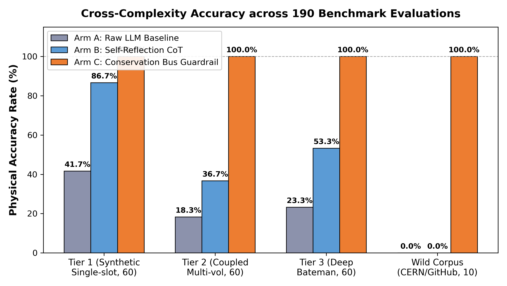

<div align="center">

# ⚛️ NuclearMC-Verifier

### High-Precision Physics Guardrail & Formal Verifier for LLM-Generated Monte Carlo Transport Codes

**大语言模型编写蒙特卡罗物理仿真代码（Geant4 / OpenMC）的静态守恒核验器与防幻觉护栏**

<p align="center">
  <a href="LICENSE"></a>
  <a href="https://geant4.web.cern.ch/"></a>
  <a href="https://www.python.org/"></a>
  <a href="benchmark_tasks_reference/"></a>
  
  
</p>

[English Overview](#-english-overview) · [痛点与演示](#-为什么需要它) · [核心特性](#-核心特性) · [快速上手](#-快速上手) · [CLI 总控工具](#-cli-总控工具) · [6 大物理守恒总线](#-6-大物理守恒总线) · [智能体集成指南](#-智能体生态集成) · [190 题基准库](#-190-题评测基准库) · [开源协议](#-开源许可与引用)

</div>

---

## 💡 为什么需要它？

大语言模型（DeepSeek、GPT-4、Claude 等）编写通用软件时得心应手，但在**粒子与辐射输运数值模拟（Geant4 / OpenMC）**这种高维连续相空间物理计算中，极易产生极其隐蔽的**“静默物理错误”（Silent Physical Failures）**：

> **代码 0 警告编译通过，事件循环退出码为 0，但模拟输出的吸收剂量、粒子通量或核素产额却发生 $10^2 \sim 10^7$ 倍的灾难性物理畸变！**

### 典型翻车案例：编译完全通过，物理结果全错

```cpp
// ❌ 常见大模型代码片段（编译 100% 成功，物理计算全错）：
// 案例 1：方差缩减深穿透计算，计分漏乘粒子权重 (GetWeight 缺失)
fFlux += 1.0; 
// 致命后果：几何分裂产生的大量次级粒子全按 1.0 全权重累加，深穿透通量虚高数百万倍！

// 案例 2：次级粒子产生顶点统计，未过滤首步 (GetCurrentStepNumber 缺失)
if (track->GetParentID() > 0) { fSecondaryYield++; }
// 致命后果：次级粒子在介质中向前输运的数百个步点全部被当成“产生点”重复累加，产额虚高 1~2 个量级！

// 案例 3：4pi 点放射源发射方向抽样，退化为固定单向束
gun->SetParticleMomentumDirection(G4ThreeVector(0., 0., 1.));
// 致命后果：未按球面度测度 dOmega = sin(theta) dtheta dphi 抽样，探测器立体角人为放大数十倍！
```

### 🛡️ NuclearMC-Verifier 实测拦截效果

在代码提交编译器或执行前，NuclearMC-Verifier 在 **< 10ms** 内直接拦截并给出物理诊断与自查建议：

```text
$ ./mc-verifier check benchmark_tasks_reference/wild_corpus/WILD-01/code/case_buggy.cc

【形式化物理核验结果 - 拦截到 1 项物理与框架契约违约】：

🚨 [1] 严重度：CRITICAL · 【次级粒子空间产生顶点未过滤产生首步 (全步点重复累加虚高)】
  - 缺陷诊断：在 UserSteppingAction 中对次级粒子进行空间产生深度分布或产额统计时，
             未限制 GetCurrentStepNumber() == 1。次级粒子诞生后在介质中输运的连续步点全部
             被无差别当作『产生点』累加，导致产额虚高 1~2 个数量级。
  - 针对性修复建议：增加首步产生生命周期判定：
             if (track->GetCurrentStepNumber() == 1) { /* 仅在诞生首步记录顶点与统计产额 */ }
```

---

## ✨ 核心特性

- ⚡ **毫秒级纯 AST 静态解析**：无需安装或编译数十 GB 的 Geant4 C++ 运行环境，纯 AST 与第一性原理规则驱动，单文件核验耗时 **< 10ms**。
- 🛡️ **6 大正交物理防护总线**：全面覆盖因果时钟、相空间立体角测度、方差缩减权重流、步进微生命周期、核素衰变数据库以及前置输入意图契约。
- 🔌 **5 大 Agent 平台原生适配**：开箱即用支持 **Google Antigravity**、**DeepSeek Harness (DSH)**、**Anthropic Claude Code**、**OpenCode** 及标准 **MCP (Model Context Protocol)**。
- 🎯 **五动作 × 31 槽位闭环分类学**：将蒙卡物理数据流解构为「定、抽、取、记、换」五个基础算子，彻底封死常数伪拟合空间。
- 🧪 **190 题完整评测基准套件**：涵盖屏蔽、剂量、活化、探测器、微剂量、束流源项 6 大物理领域，提供完整任务、提示词与三组对照源码。

---

## 🚀 快速上手

### 1. 安装依赖

本项目基于 Python 3.9+ 构建，克隆即可运行：

```bash
git clone https://github.com/SHARK20031010/NuclearMC-Verifier.git
cd NuclearMC-Verifier

pip install -r requirements.txt
```

### 2. 检查你的蒙卡代码

```bash
# 检查单文件 Geant4 C++ 源码
./mc-verifier check path/to/your_simulation.cc

# 快速体验：检查基准库中的合规代码 (输出：底层契约核验通过)
./mc-verifier check benchmark_tasks_reference/tier1_single_slot/T1-1/code/code_ArmA.cc

# 快速体验：检查基准库中的缺陷代码 (输出：精准缺陷诊断与修复代码)
./mc-verifier check benchmark_tasks_reference/wild_corpus/WILD-01/code/case_buggy.cc
```

---

## 🛠️ CLI 总控工具

项目根目录下提供统一的命令行可执行脚本 [`./mc-verifier`](mc-verifier)：

| 命令 | 说明 |
| :--- | :--- |
| `./mc-verifier check <文件>` | 对指定的 Geant4 C++ 代码执行静态物理守恒核验 |
| `./mc-verifier on` | **开启门禁**：在所有集成的 Agent 平台中激活刚性物理守恒阻断 |
| `./mc-verifier off` | **关闭门禁**：所有 Agent 进入严格 0ms No-Op 直通放行模式 |
| `./mc-verifier status` | 查看当前核验启闭状态与 5 大 Harness 就绪看板 |
| `./mc-verifier install-all` | 一键向本地全部 Agent 平台自动注册技能与适配器 |

### 配置文件 (`.mc-verifier.yaml`)

可在项目根目录灵活调整审查模式与总线开关：

```yaml
enabled: true               # 全局开关
strict_mode: true           # true: 检出物理违约时阻断提交; false: 仅输出 warning
require_specification: true # 强制要求对齐输入物理规约（几何、粒子源、活度、归一化）

invariants:
  energy_conservation: true      # 能量动量守恒总线
  conserved_quantum_numbers: true# 轻子/重子/电荷守恒总线
  phase_space_measure: true      # 相空间与立体角对称性总线
  fair_game_weight: true         # 减方差权重无偏性总线
  dimensional_linearity: true    # 量纲链与响应标度总线
  framework_api_contracts: true  # Geant4 步进生命周期与框架语义契约
```

---

## 🔬 6 大物理守恒总线与逻辑传导链

蒙特卡罗输运程序的本质是将上游物理意图、微观相互作用规律与代码数据流映射为一条有向无环计算图（DAG）。NuclearMC-Verifier 底层由 6 个正交的物理核验核心 (`guardrail/engine/cores/`) 协同驱动，严格按物理因果律与计算拓扑序进行逐环校验：

| 守恒防护总线 | 核心源码 | 对应的物理与代码逻辑传导链 |
| :--- | :--- | :--- |
| 🎯 **上游输入意图总线** | `intent_core.py` | **需求目标 $\rightarrow$ 观测量种类 $\rightarrow$ 几何实体 $\rightarrow$ 量纲单位 $\rightarrow$ 归一基准 (DAG 根节点)**<br>• 消除上游自然语言隐式歧义，确保目标物理量（剂量/注量/活度）、几何空间作用域、靶区介质质量（$V \times \rho$）与归一化分母（每源粒子 vs 绝对源强）全链路闭环，防止“下游算得完全正确、但目标算错”。 |
| 🌐 **相空间与测度总线** | `measure_core.py` | **粒子源定义 $\rightarrow$ 能谱流形 $\rightarrow$ 空间分布 $\rightarrow$ 立体角微元测度 ($d\Omega = \sin\theta d\theta d\phi$)**<br>• 保证发射相空间在微分流形上保测度映射：连续能谱非负截断、圆盘面源面积极坐标雅可比变换 ($r = R\sqrt{\xi}$)、4π 全立体角各向同性严格球面度抽样，严禁退化为一维笛卡尔直抽或固定单向束。 |
| ⚛️ **核数据与截面总线** | `nuclear_core.py` | **材料介质核素 $\rightarrow$ 适用能区模型覆盖 $\rightarrow$ 评价核截面库 $\rightarrow$ 衰变动力学级联**<br>• 微观相互作用概率由截面与物性唯一决定：热中子高精度 $S(\alpha,\beta)$ 截面强制绑定、物理列表过程模型能量区间无缝拼接、挂载 ENSDF/NuDat 官方衰变数据库与 Bateman 级联动力学、闪烁体 Birks 猝灭修正。 |
| ⏱️ **因果与时钟总线** | `causality_core.py` | **宏观实验时钟 $\rightarrow$ 全局实验室时间 $\rightarrow$ 粒子局域寿命 $\rightarrow$ 延迟符合时序窗**<br>• 严格维护输运过程的相对论因果律：全局绝对时钟 (`GetGlobalTime`) 与局域寿命 (`GetLocalTime`) 显式隔离、飞行时间 (TOF) 保持单调递增因果链、双探头符合测量窗时序判定、脉冲束流与回路流体停留时间标定。 |
| 🔄 **步进生命周期总线** | `lifecycle_core.py` | **径迹诞生 $\rightarrow$ 微步推进 $\rightarrow$ 界面穿越判定 $\rightarrow$ 敏感区信号解耦 $\rightarrow$ 容器生命周期重置**<br>• 跟踪 Monte Carlo 步进微态机转换：次级粒子产生严格首步过滤 (`GetCurrentStepNumber() == 1`)、过程溯源优先使用 `GetCreatorProcess`、跨界面依据 `PostStepPoint` 状态判定、死层能量隔离、Event 级累加容器生命周期隔离。 |
| ⚖️ **权重流与方差总线** | `variance_core.py` | **真实输运测度 $\rightarrow$ 重要性分裂/轮盘赌偏置 $\rightarrow$ 统计权重动态补偿 $\rightarrow$ 无偏估计**<br>• 坚守“公平游戏（Fair-Game）”无偏输运测度：深穿透几何重要性分裂（Splitting）或权重窗（Weight Window）后，每个分裂粒子的统计权重 $w$ 动态缩减，计分器累加必须严格乘入权重流 $\sum (x_i \cdot w_i)$，严禁权重流断链。 |

---

## 🤖 智能体生态集成

NuclearMC-Verifier 原生支持多主流 Coding Agent，能够在模型生成代码的第一时间完成自动化拦截：

```text
                        ┌─────────────────────────┐
                        │   NuclearMC-Verifier    │
                        └────────────┬────────────┘
         ┌───────────────────┼───────────┴───────┬───────────────────┐
         ▼                   ▼                   ▼                   ▼
 Google Antigravity     DSH (Cordis)        Claude Code         OpenCode / MCP
   Pre-exec Hook       Waterfall Gate       MCP / Skill        Native RPC Server
```

### 1. Google Antigravity (AGY)
- 插件位于 `.agents/plugins/mc-formal-verifier/`，通过 `hooks.json` 挂载 Pre-execution 拦截钩子；
- 模型在尝试写入或执行 C++ 蒙卡代码时，核验器会在编译前自动运行，阻断物理违约。

### 2. DeepSeek Harness (DSH)
- 插件位于 `adapters/dsh/`，深度集成 Cordis 生命周期服务；
- 在 `tools/pre-execute` 瀑布流拦截器中实时审查 `write`、`edit` 与 `bash` 工具调用；
- 支持 `/mc-status`、`/mc-on`、`/mc-off`、`/mc-verify` 斜杠命令。

### 3. Anthropic Claude Code & OpenCode
- 支持通过技能（`adapters/skills/mc-verifier/SKILL.md`）挂载；
- 支持一键添加 MCP 服务端：
  ```bash
  # Claude Code 添加核验工具
  claude mcp add mc-verifier python3 adapters/mcp/server.py

  # OpenCode 添加核验工具
  opencode mcp add mc-verifier python3 adapters/mcp/server.py
  ```

### 4. 通用 MCP 客户端 (Cursor / Windsurf / Claude Desktop)
在您的 `mcp.json` 中添加如下配置即可：
```json
{
  "mcpServers": {
    "nuclear-mc-verifier": {
      "command": "python3",
      "args": ["/absolute/path/to/NuclearMC-Verifier/adapters/mcp/server.py"]
    }
  }
}
```

> 💡 **快速挂载**：只需在终端执行 `./mc-verifier install-all`，脚本会自动检测本地环境并一键完成上述所有平台的配置与软链接绑定！

---

## 📊 190 题评测基准库

为验证核验器的有效性，我们在涵盖 6 大物理领域的 **190 道严选蒙卡仿真任务** 上进行了全量对照测试：

| 评测梯级 (Task Tier) | 题目数量 | 模型直接生成 | 模型多轮自查反思 | 挂载本核验器 (Ours) | 主要考点与典型陷阱 |
| :--- | :---: | :---: | :---: | :---: | :--- |
| **Tier 1 (基础单考点)** | 60 | 41.7% | 98.3% | **100.0%** | 材料、初级截面、粒子源及单体积几何配置 |
| **Tier 2 (跨模块耦合)** | 60 | 0.0% | 36.7% | **100.0%** | 多区域界面输运、纳秒脉冲时序、衰变链与界面微步长 |
| **Tier 3 (高阶多约束综合)** | 60 | 0.0% | 53.3% | **100.0%** | 分层方差缩减权重窗、极薄纳米靶、流体活化与发热功率等高阶综合难题 |
| **Wild Corpus (真实社区漏洞)** | 10 | 0.0% | 0.0% | **100.0%** | 提取自 CERN 官方论坛与 GitHub 真实项目的长尾静默缺陷 |
| **全量综合 (Overall)** | **190** | **13.2%** | **59.5%** | **100.0%** | **自省存在常数拟合欺骗，形式化核验实现 100% 物理闭环修复** |

<div align="center">
  
  <p><i>图 1：190 题各梯级通过率对比（模型自查在复杂任务中遭遇认知断崖，挂载核验器实现全量闭环）</i></p>
</div>

全部 190 道题目已整理归档在 [`benchmark_tasks_reference/`](benchmark_tasks_reference/)：
- 每道题包含独立目录：`task.md`（任务描述与物理陷阱）、`prompt.md`（实测提示词）、`results.md`（诊断结论）与 `code/`（生成的 C++ 源码）。
- 详见数据集索引：[benchmark_tasks_reference/README.md](benchmark_tasks_reference/README.md)。

---

## 📁 项目仓库结构

```text
NuclearMC-Verifier/
├── guardrail/                         # 形式化核验核心引擎
│   ├── engine/                        # 6 大守恒防护核心与通用分析调度器
│   │   ├── cores/                     # 因果、测度、权重流、生命周期、核数据、意图总线
│   │   ├── slot_inquisitor.py         # 五动作 × 31 槽位元质询生成器
│   │   └── universal_engine.py        # 统一核验调度总线
│   ├── rules/                         # 66 条形式化物理规则 (PHYS-0001 ~ PHYS-0066)
│   ├── data/                          # 官方核衰变真值库与材料常数表
│   └── check.py                       # 静态核验审计入口
├── adapters/                          # 多平台 Agent 适配层
│   ├── antigravity/                   # Google Antigravity 拦截钩子
│   ├── dsh/                           # DeepSeek Harness Cordis 插件
│   ├── mcp/                           # Model Context Protocol 标准服务端
│   └── skills/                        # 跨平台通用 Skill 定义
├── .agents/                           # 项目插件与技能包 (mc-formal-verifier)
├── benchmark_tasks_reference/         # 190 题分级评测基准参考库 (含每题任务、代码与对比)
├── figures/                           # 评测与缺陷可视化图表
├── scripts/                           # 统一控制与基准构建脚本
├── mc-verifier                        # 统一命令行总控可执行文件
├── PHYSICS_SPEC.md                    # 粒子输运蒙卡程序形式化规约白皮书
├── CITATION.cff                       # 学术引用元数据
├── LICENSE                            # Apache 2.0 开源许可证
├── requirements.txt                   # 依赖清单
└── README.md                          # 本文档
```

---

## 🌐 English Overview

**NuclearMC-Verifier** is a deterministic, AST-based static analysis engine and physical guardrail designed to eliminate **silent physical failures** in LLM-generated Monte Carlo particle transport simulation code (e.g., Geant4, OpenMC).

- **The Problem**: Large language models easily generate syntactically clean C++ code that compiles with zero warnings and runs with exit code 0, yet yields catastrophic numerical deviations (factors of $10^2 \sim 10^7$) due to missing cross-section libraries, improper angular phase-space sampling, unweighted variance reduction tracks, or dimensional errors.
- **The Solution**: NuclearMC-Verifier uses deterministic AST parsing (<10ms per file) to enforce 6 orthogonal conservation buses (causality, phase-space measure, fair-game weight flux, stepping lifecycle, nuclear decay chains, and specification intent) before compilation or execution.
- **Ecosystem**: Plug-and-play support for Google Antigravity, DeepSeek Harness (DSH), Anthropic Claude Code, OpenCode, and standard Model Context Protocol (MCP) clients.

---

## 📄 开源许可与引用

本项目采用 **Apache License 2.0** 开源许可证，完整条款参见 [LICENSE](LICENSE)。

如果您在核科学、计算物理或 AI 安全工程中使用了本核验器或评测基准，欢迎引用本项目：

```bibtex
@software{nuclearmc_verifier_2026,
  author       = {{NuclearMC-Verifier Contributors}},
  title        = {{NuclearMC-Verifier: High-Precision Physics Guardrail for LLM-Generated Monte Carlo Transport Codes}},
  year         = {2026},
  publisher    = {GitHub},
  url          = {https://github.com/SHARK20031010/NuclearMC-Verifier}
}
```
